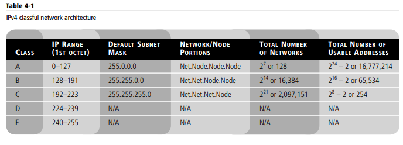
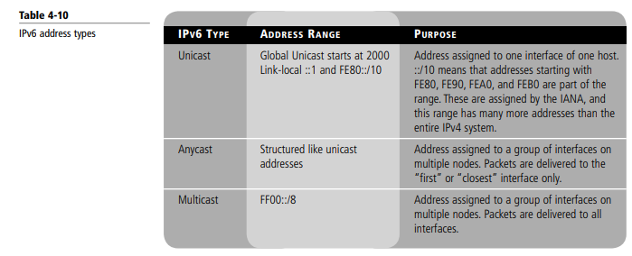

# redes_fatec

## Understanding Internet Protocol

## IPv4

- 32-bit
- The IPv4 classification system is known as the classful network architecture and is broken 
down into five sections, three of which are commonly used by hosts on networks—Classes A, 
B, and C. All five sections are displayed in Table 4-1. The first octet of the IP address defines 
which class the address is a member of.

</img>

## IPv6

- 128-bit

</img>

# Router 
- IP público
- IP privado

## NAT

- MAC Address (Midia Access Control): número da placa de rede, identificação física

## Subnetting

- Possibilidade de separação lógica por atribuição de IP lógico
